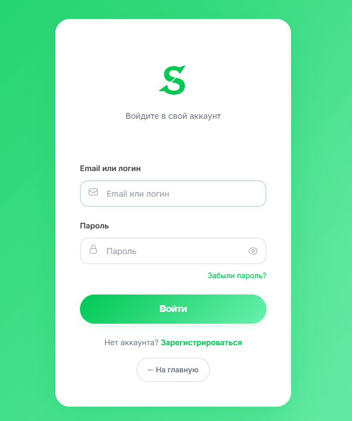
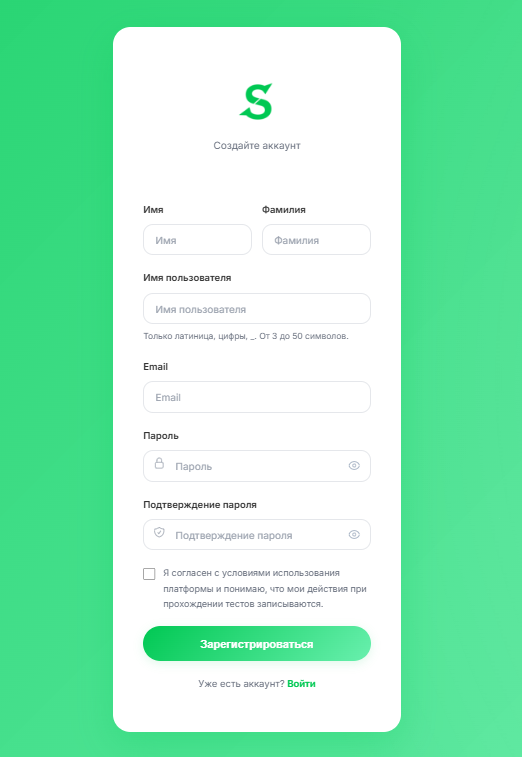
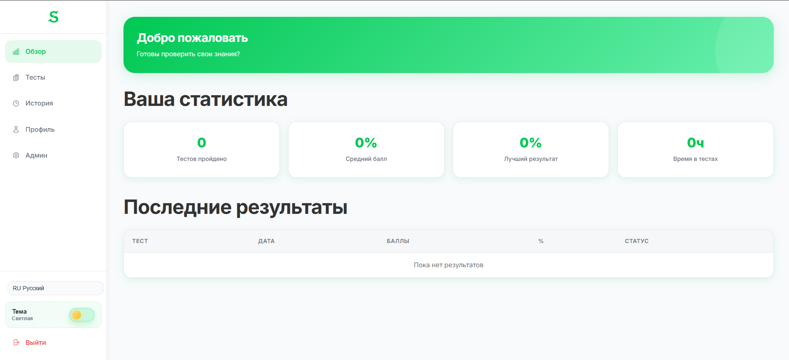

# Sapienta

> Веб-платформа для онлайн-тестирования с админ-панелью, результатами, логами контроля и записью экрана во время прохождения теста.

[](https://www.php.net/)
[](https://www.mysql.com/)
[](https://developer.mozilla.org/docs/Web/JavaScript)
[](#)

## Описание

`Sapienta` - это учебная веб-система для проведения тестирования студентов. Проект позволяет создавать тесты, проходить их в браузере, сохранять результаты, отслеживать подозрительные действия и просматривать записи экрана.

Система рассчитана на:

- студентов, которые проходят тесты;
- преподавателей и администраторов, которые создают тесты и анализируют результаты;
- учебные проекты, практические работы и демонстрацию системы онлайн-контроля.

## Основные возможности

- регистрация и авторизация пользователей;
- личный кабинет студента;
- прохождение тестов с таймером;
- автоматическое сохранение и отправка результатов;
- админ-панель для управления пользователями и тестами;
- добавление вопросов и вариантов ответов;
- импорт тестов из CSV;
- просмотр результатов всех пользователей;
- логи античит-контроля;
- запись экрана во время тестирования;
- просмотр записей экрана в админ-панели;
- профиль пользователя с аватаром и личными данными;
- переключение языка интерфейса;
- светлая и темная тема;
- адаптивный интерфейс для разных экранов.

## Интерфейс проекта

Ниже показаны основные пользовательские экраны проекта: вход в аккаунт, регистрация нового пользователя и личный кабинет после авторизации.

<table>
  <tr>
    <td width="50%" align="center">
      <h3>Авторизация</h3>
      <p>Минималистичная форма входа с единым визуальным стилем Sapienta.</p>
      
    </td>
    <td width="50%" align="center">
      <h3>Регистрация</h3>
      <p>Создание аккаунта студента с подтверждением пароля и согласием с условиями.</p>
      
    </td>
  </tr>
  <tr>
    <td colspan="2" align="center">
      <h3>Личный кабинет</h3>
      <p>Главная панель пользователя со статистикой, историей результатов, тестами и настройками профиля.</p>
      
    </td>
  </tr>
</table>

## Технологический стек

| Часть проекта | Технологии |
| --- | --- |
| Backend | PHP 8+, PDO |
| Database | MySQL / MariaDB |
| Frontend | HTML, CSS, JavaScript |
| Авторизация | JWT, сессии, CSRF |
| Интерфейс | Адаптивная верстка, кастомные компоненты |
| Хранение файлов | `uploads/` |
| Логи | `logs/` |

## Требования

Для локального запуска:

- Windows, Linux или macOS;
- XAMPP или другой локальный сервер с Apache;
- PHP 8.0 или выше;
- MySQL 5.7 / MariaDB или выше;
- браузер Chrome, Edge, Firefox или Safari.

Для работы записи экрана:

- сайт должен открываться через `HTTPS` или `localhost`;
- браузер должен поддерживать `MediaRecorder` и `getDisplayMedia`;
- на телефонах запись экрана может быть ограничена браузером или операционной системой.

## Установка и запуск

### 1. Скопируйте проект

Поместите проект в папку локального сервера:

```bash
C:\xampp\htdocs\test-platform
```

### 2. Запустите сервер

В XAMPP включите:

- `Apache`
- `MySQL`

После запуска проект будет доступен по адресу:

```text
http://localhost/test-platform/
```

### 3. Создайте базу данных

Откройте phpMyAdmin:

```text
http://localhost/phpmyadmin
```

Создайте базу данных:

```text
test_platform
```

Рекомендуемая кодировка:

```text
utf8mb4_unicode_ci
```

### 4. Импортируйте SQL

Для локального запуска используйте:

```text
sql/database.sql
```

Для хостинга можно использовать общий файл:

```text
sql/database-hosting-all-in-one.sql
```

Если база уже создана и нужно добавить только отдельные обновления, используйте миграции из:

```text
database/migrations/
sql/migrations/
```

### 5. Проверьте подключение к базе

Основные настройки находятся в:

```text
config/config.php
```

Для локального окружения по умолчанию используются:

```text
DB_HOST = localhost
DB_NAME = test_platform
DB_USER = root
DB_PASS =
```

Для продакшена лучше задавать данные через переменные окружения:

```text
DB_HOST
DB_PORT
DB_NAME
DB_USER
DB_PASS
JWT_SECRET
APP_ENV
APP_DEBUG
```

Не храните реальные пароли от базы данных в публичном репозитории.

## Структура проекта

```text
test-platform/
├── api/                 # API для авторизации, тестов, админки и записей
├── config/              # Конфигурация проекта
├── database/            # Миграции базы данных
├── docs/                # Документация
├── logs/                # Логи ошибок и событий
├── public/
│   ├── css/             # Стили интерфейса
│   └── js/              # JavaScript, API-клиент, i18n, UI-логика
├── sql/                 # SQL-схемы и файлы импорта
├── src/
│   ├── helpers/         # Вспомогательные классы
│   ├── middleware/      # Проверка авторизации
│   └── models/          # Модели данных
├── uploads/             # Загружаемые файлы и записи
├── admin.php            # Админ-панель
├── dashboard.php        # Кабинет пользователя
├── index.php            # Главная страница
├── login.php            # Вход
├── profile.php          # Профиль
├── recordings.php       # Просмотр записей экрана
├── register.php         # Регистрация
└── test.php             # Прохождение теста
```

## Инструкция пользователя

### Регистрация

1. Откройте страницу регистрации.
2. Заполните имя, фамилию, логин, email и пароль.
3. Подтвердите регистрацию.
4. После успешной регистрации войдите в аккаунт.

### Авторизация

1. Откройте страницу входа.
2. Введите email или логин.
3. Введите пароль.
4. Нажмите кнопку входа.

После авторизации пользователь попадает в личный кабинет.

### Личный кабинет

В кабинете пользователь может:

- просматривать доступные тесты;
- начинать прохождение теста;
- видеть историю попыток;
- открывать результаты;
- переходить в профиль.

### Прохождение теста

1. Выберите тест в личном кабинете.
2. Нажмите кнопку начала теста.
3. Разрешите запись экрана, если браузер запросит доступ.
4. Ответьте на вопросы.
5. Завершите тест.
6. После отправки система покажет результат.

Во время теста система может фиксировать:

- переключение вкладок;
- потерю фокуса окна;
- попытки копирования;
- подозрительно быстрые ответы;
- технические события записи экрана.

### Админ-панель

Администратор может:

- просматривать пользователей;
- блокировать и разблокировать аккаунты;
- создавать тесты;
- добавлять вопросы;
- импортировать тесты из CSV;
- смотреть логи контроля;
- смотреть результаты;
- открывать записи экрана студентов.

## CSV-импорт тестов

В админ-панели можно импортировать вопросы из CSV-файла.

Пример структуры:

```csv
test_title,question_text,question_type,points,answer_text,is_correct
Пример теста,Какие числа четные?,multiple,2,2,1
Пример теста,Какие числа четные?,multiple,2,3,0
Пример теста,Какие числа четные?,multiple,2,4,1
```

Рекомендации:

- используйте кодировку `UTF-8`;
- вопросы одного теста должны идти последовательно;
- для правильного ответа указывайте `1`;
- для неправильного ответа указывайте `0`.

## Запись экрана

Система поддерживает запись экрана во время прохождения теста.

Важно:

- запись лучше всего работает на ПК;
- сайт должен быть открыт через `localhost` или `HTTPS`;
- мобильные браузеры могут не поддерживать полноценную запись экрана;
- если запись недоступна, тест всё равно может использовать античит-логи.

Записи можно просматривать в админ-панели во вкладке `Записи`.

## Частые ошибки и решения

### Не открывается сайт

Проверьте:

- запущен ли Apache;
- лежит ли проект в `htdocs`;
- правильный ли адрес: `http://localhost/test-platform/`.

### Ошибка подключения к базе данных

Проверьте:

- запущен ли MySQL;
- создана ли база данных;
- импортирован ли SQL-файл;
- совпадают ли настройки в `config/config.php`.

### Вместо JSON приходит HTML

Обычно это значит, что API завершился ошибкой PHP.

Что проверить:

- включен ли сервер;
- доступна ли база данных;
- нет ли ошибок в `logs/error.log`;
- импортированы ли все таблицы.

### Текст отображается кракозябрами

Проверьте:

- кодировку базы данных `utf8mb4`;
- кодировку таблиц `utf8mb4_unicode_ci`;
- наличие `<meta charset="UTF-8">` на странице;
- очистите кэш браузера через `Ctrl + F5`.

### Запись экрана не работает на телефоне

Это может быть ограничением мобильного браузера.

Решения:

- проходить тест с ПК;
- использовать HTTPS;
- включить fallback-контроль без записи экрана;
- для полноценной мобильной записи делать отдельное нативное приложение.

## Безопасность

В проекте используются:

- CSRF-токены;
- JWT-авторизация;
- проверка роли администратора;
- подготовленные SQL-запросы;
- ограничение попыток входа;
- безопасная загрузка файлов;
- логирование действий.

Перед публикацией проекта:

- отключите `APP_DEBUG`;
- задайте собственный `JWT_SECRET`;
- не публикуйте реальные пароли от базы;
- проверьте права на папки `uploads/` и `logs/`;
- используйте HTTPS.

## Рекомендации для GitHub

Перед загрузкой проекта в репозиторий:

1. Проверьте `.gitignore`.
2. Не загружайте реальные записи экрана из `uploads/`.
3. Не загружайте приватные ключи и пароли.
4. Проверьте, что SQL-файл не содержит лишних персональных данных.
5. После обновления README сделайте коммит:

```bash
git add README.md
git commit -m "Обновил README проекта"
git push
```

## Заключение

`Sapienta` показывает полный цикл работы системы онлайн-тестирования: от регистрации пользователя до анализа результатов администратором. Проект подходит для учебной практической работы, демонстрации веб-разработки на PHP и реализации базовых механизмов контроля во время тестирования.
